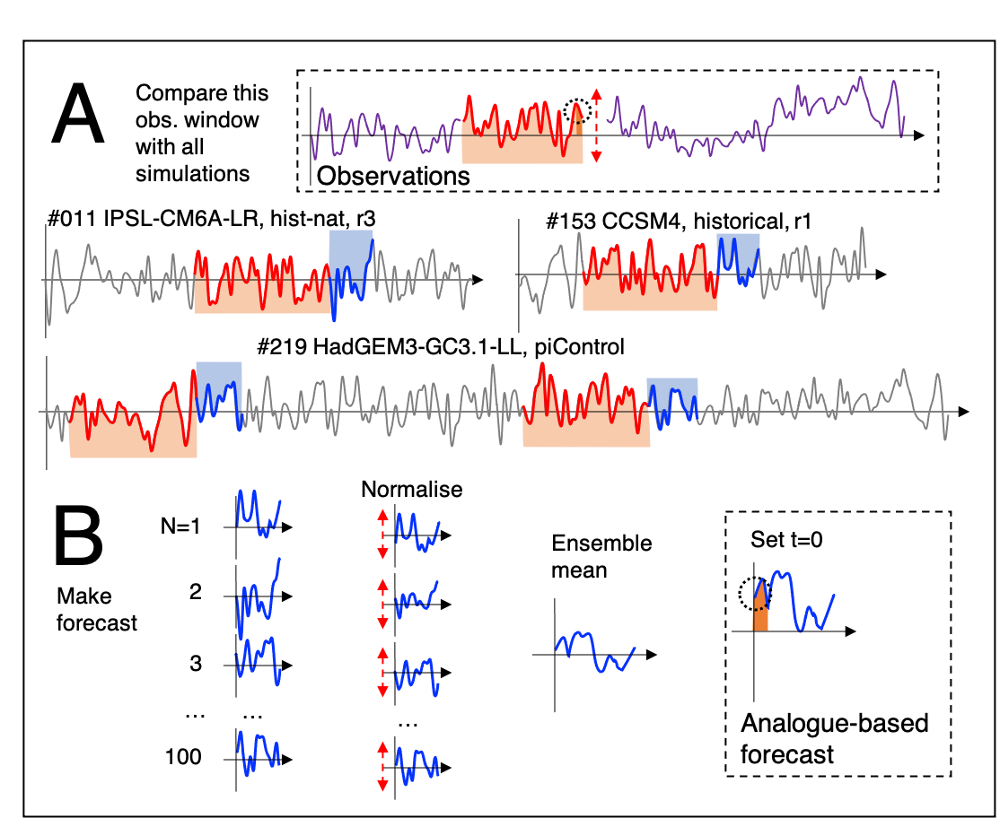

# StatisticalForecast
Code and instructions for making analogue/statistical forecasts using CMIP5/6 data

## Things currently being worked on
1. MATT - Check out latest version and confirm I can get it (re)working on Jasmin
2. MATT - Develop a structuring approach to set up directories in the program
3. LEO - Should the intermediate files, which are currently Python pickle files, be something more interoperable? Perhaps it would be good to be able to store the VERSION number of the code that created the files in the files themselves

## Short term future plans
1. A script to `touch` the temporary files on Jasmin so we don't have to keep recreating them (they are auto-deleted after 1 month)
2. ...

## Mid term plans
1. A way of running the system backwards - e.g. in order to estimate which variables/regions would have been most useful for a particular forecasts. To then try and understand *why* that would be in order to design a better forward forecast system. Have to be careful not to cheat though.
2. Make newer and better metrics for actually choosing the analogue predictors
3. Consider more intelligent methods of combining the analogue predictors. Currently we use a linear, equally weighted combination after normalising the variance
4. ...

## Long term targets
1. A flexible system where you can specify a (set of) (CMIP) variables/regions/timescales as predictors and make forecasts of another user-specified variable/region over timescales also specified by the user. In addition, the ability to plug-and-play different methods for choosing the analogues (e.g. RMSE difference; correlation patterns; combinations of these)
2. The ability to use more advanced ML methods to pick the analogues, such as CNNs targetted at specific regions (e.g. North Atlantic SSTs)

## Finished tasks
1. DONE LEO - Abstract out file paths into an initialisation file so it is easier to run as a different user. Could we make it automatic based on your username?
2. DONE LEO - Separate out as much as possible the metric used to choose the analogues. In order to allow us to make progress (see below) by defining newer, better metrics
3. DONE LEO - Include a 'testing' function for the scripts to enable quick development and trouble shooting

## Very general workflow
1. Run `SUBMIT_ProcessVarsCMIP.sh` with some input (e.g. `cmip6` ) to create the pre-processed data
2. Run `SUBMIT_Sbatch_AnalogueCache_Spatial.sh` (which calls `AnalogueCache_Spatial.py` ) to do some analysis of _spatial_ data
3. And `SUBMIT_Sbatch_AnalogueCache_Spatial_Skill.sh` (which calls `AnalogueCache_Spatial_Skill.py` ) to calculate the skill of some of this spatial data
4. Run `SUBMIT_AnalyseAnalogueSource.sh` (which calls `AnalyseAnalogueSource2_Jasmin.py` ) to do some analysis of the analogue fields that were used above

## Description of files
- `SUBMIT*` - wrapper scripts (Shell) that take some input (e.g. `cmip6` - see scripts) and submit jobs to the Jasmin queues, calling the python scripts
- `queue_spacer_sbatch.sh` - A script to ensure we don't submit too many jobs at once. I'm not sure if this is necessary
- `analogue.py` and `cmip.py` and `mfilter.py` - Somewhere where I have stored custom code relevant for this work
- `selection.py` specifies the procedure on which the selection of the analogues is based
- `AnalogueCache_Spatial.py` - To find the best (based on a given method) analogue source data from the pre-processed data
- `AnalogueCache_Spatial_Skill.py` - To take those source files and estimate the skill of the predictions
- `AnalyseAnalogueSource2_Jasmin.py` - To look at the source files for the skill (maps) and do some analysis of these

